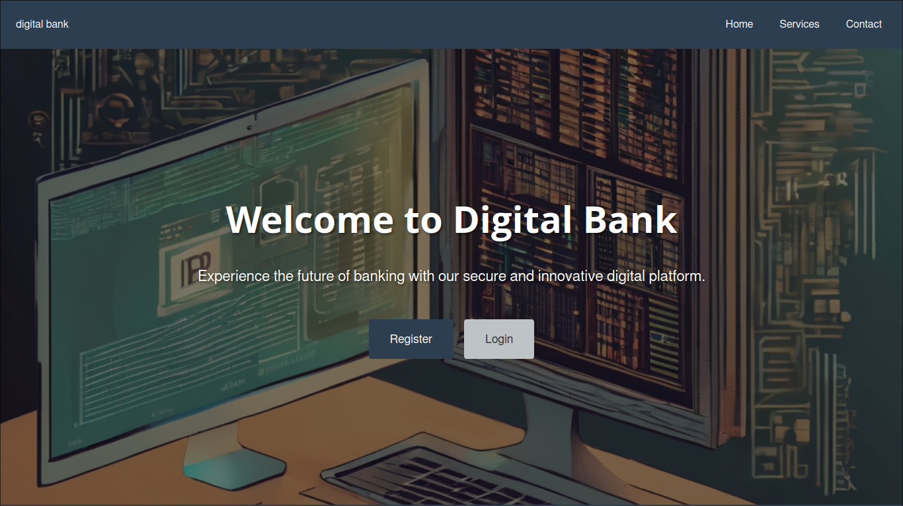
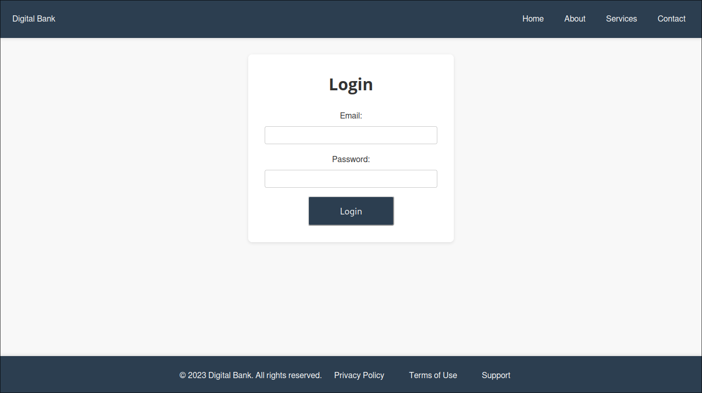
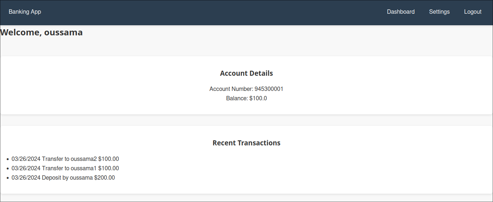

# Bank Project

Welcome to the Bank Project! This project is a simple banking application developed using Flask and SQLAlchemy.

## Overview

The Bank Project allows users to register for accounts, login securely, and perform basic banking transactions such as depositing funds and viewing transaction history. It provides a minimal viable product (MVP) for a banking application.

## Features

- User registration and login system
- Secure authentication and password hashing
- Account balance management
- Transaction history tracking
- Deposit funds functionality

## Installation

1. **Clone the Repository**: 
git clone https://github.com/oussamaafnakkar/MVP-Bank.git

2. **Navigate to the Project Directory**:
cd MVP-Bank

3. **Install Dependencies**:
pip install -r requirements.txt (use venv)

4. **Set Up the Database**:
- Run the following commands to set up the SQLite database:
  ```
  flask db init
  flask db migrate -m "Initial migration"
  flask db upgrade
  ```

5. **Run the Application**:
python app.py

6. **Access the Application**:
- Open your web browser and go to `http://localhost:5000` to access the Bank Project.

## Usage

1. **Register for an Account**:
- Click on the "Register" link and fill out the registration form with your details.

2. **Login to Your Account**:
- After registering, you can login using your email and password.

3. **Deposit Funds**:
- Once logged in, you can deposit funds into your account by clicking on the "Deposit" link and filling out the deposit form.

4. **View Transaction History**:
- You can view your transaction history by navigating to the "Dashboard" page.

## Screenshots





## Contributing

Contributions are welcome! If you have any suggestions, feature requests, or bug reports, please open an issue or submit a pull request.


